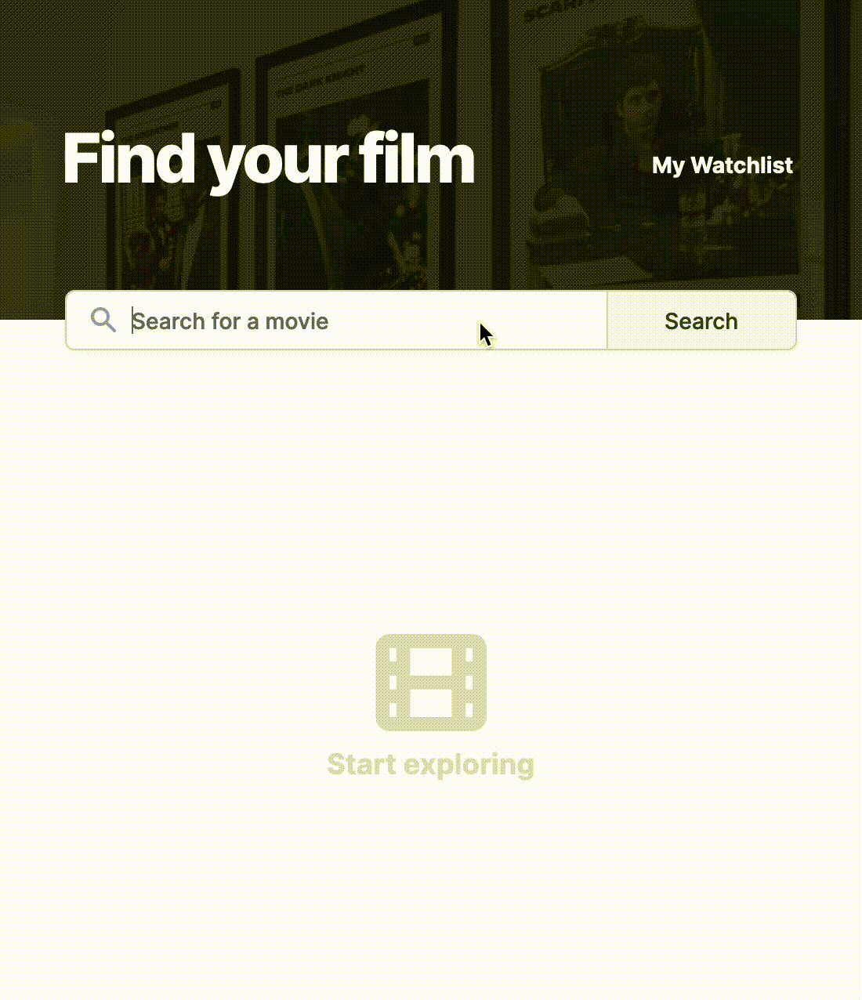

# Movie Watchlist

This is the Movie Watchlist project in the Scrimba Frontend Developer Career Path.

## Table of contents

-   [Overview](#overview)
    -   [The challenge](#the-challenge)
    -   [Requirements](#requirements)
    -   [Screenshot](#screenshot)
    -   [Links](#links)
-   [My process](#my-process)
    -   [Built with](#built-with)
    -   [What I learned](#what-i-learned)
    -   [Continued development](#continued-development)
    -   [Useful resources](#useful-resources)
-   [Author](#author)

## Overview

### The challenge

The challenge was to create a Movie Watchlist app using a Figma design. Users can search for a movie, and the app will use an API to get the results. The users can also save movies to a watchlist, and this list will persist during different sessions.

### Requirements

-   Two pages - `index.html` and `watchlist.html`.
-   Index = search page. Calls to [OMDB API](https://www.omdbapi.com/) with the title searched for and displays search results.
-   Button to "add to watchlist" which saves that data to local storage.
-   `watchlist.html` loads and displays data from local storage.
-   Light and Dark themes

### Screenshot

### Links

-   Solution URL: <https://github.com/gdsimoes/movie-watchlist/>
-   Live Site URL: <https://gdsimoes.github.io/movie-watchlist/>

## My process

### Built with

-   Figma
-   Sass (SCSS)
-   REST API
-   Web Storage API
-   Shadow DOM Manipulation
-   SVG Manipulation
-   ES6 Modules

### What I learned

As usual, the JavaScript portion of the project was the easy part. I practiced using the 'fetch' function to make API requests, used localStorage to save the user's movie list, and created modules to dynamically populate the #movies element. It was the most complex webpage I built regarding the JavaScript code, with five modules.

But getting the layout to work flawlessly on different browsers was, by far, the greatest challenge. For example, a considerable amount of effort was necessary to customize the search bar, and iOS Safari was a constant source of frustration. Making the 'read more' functionality work just like the design was tricky because the text-overflow property wasn't flexible enough. Fortunately, after learning a lot about how rendering works in browsers, I created a module that put the ellipsis and the button in precisely the right place.

Finally, I had to learn about SVG manipulation to make the SVG icons I got from the Figma design colour differently according to the system configuration of Light/Dark mode.

### Continued development

The original Figma design doesn't work with smaller screen sizes, so I was unsatisfied with how the website functions in iOS Safari. From now on, I will only work on projects with Figma designs for multiple screen sizes.

I also used a simple but inefficient algorithm for the 'read more' functionality. I might, in the future, create a more general module that does that and uses an adaptation of binary search with memoization to speed things up.

### Useful resources

-   [W3 Schools - Change Placeholder Color](https://www.w3schools.com/howto/howto_css_placeholder.asp) - Changing the placeholder colour in search bars is not straightforward among different browsers, but this simple article helped me do it.
-   [Digital Ocean - How to Change a CSS Background Image’s Opacity](https://www.digitalocean.com/community/tutorials/how-to-change-a-css-background-images-opacity) - As usual, this Digital Ocean article is comprehensive and well-written.
-   [Stack Overflow - text-overflow change content of ellipsis](https://stackoverflow.com/questions/41549021/text-overflow-change-content-of-ellipsis) - Getting the 'read more' functionality to work was challenging, but an answer here nudged me in the right direction.
-   [MDN - Element.closest()](https://developer.mozilla.org/en-US/docs/Web/API/Element/closest) - A simple article explaining a useful method with enlightening examples.
-   [MDN - pointer-events](https://developer.mozilla.org/en-US/docs/Web/CSS/pointer-events) - Initially, I had a bug where the user could still interact with a removed movie item while it was fading. This property helped me fix that.

## Author

-   Website - <https://gdsimoes.com>
-   LinkedIn - [Guilherme Dias Simoes](https://www.linkedin.com/in/gdsimoes)
